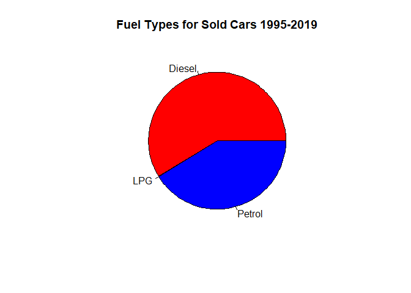
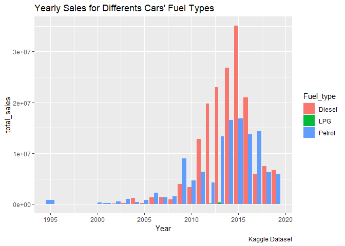
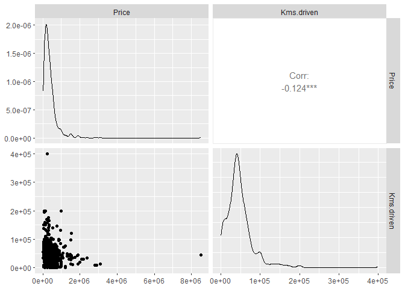
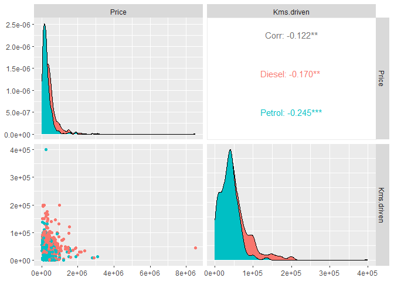

Car-Resale-Analysis
================
EricMulaa
2023-05-03

``` r
car_data1 <- read.table(file = "quikr_car.csv", header = TRUE, sep = ",")
table(car_data1$Company.name)
```

    ## 
    ##       2012          7          9        all        Any       Audi        BMW 
    ##          1          1          1          1          1         11          8 
    ##  Chevrolet Commercial     Datsun       Fiat      Force       Ford  Hindustan 
    ##         35          6          8          4          4         31          3 
    ##      Honda    Hyundai          i          I     Jaguar       Jeep       Land 
    ##         61        145          1          3          2          1          1 
    ##   Mahindra     Maruti     MARUTI   Mercedes       Mini Mitsubishi     Nissan 
    ##        100        235          2          6          8          6          6 
    ##    Renault       Sale    scratch       sell    selling      Skoda      Swift 
    ##         34          2          1          1          1         13          1 
    ##       Tara       tata       Tata       TATA     Toyota     urgent     URJENT 
    ##          1          3         74          1         39          2          1 
    ##       Used       very Volkswagen      Volvo       Well     Yamaha 
    ##          2          1         20          1          1          1

``` r
sum(is.na(car_data1))
```

    ## [1] 0

``` r
head(car_data1)
```

    ##                              Name.of.car Company.name Year         Price
    ## 1   Hyundai Santro Xing XO eRLX Euro III      Hyundai 2007        80,000
    ## 2                Mahindra Jeep CL550 MDI     Mahindra 2006      4,25,000
    ## 3             Maruti Suzuki Alto 800 Vxi       Maruti 2018 Ask For Price
    ## 4 Hyundai Grand i10 Magna 1.2 Kappa VTVT      Hyundai 2014      3,25,000
    ## 5       Ford EcoSport Titanium 1.5L TDCi         Ford 2014      5,75,000
    ## 6       Ford EcoSport Titanium 1.5L TDCi         Ford 2015 Ask For Price
    ##   Kms.driven Fuel_type
    ## 1     45,000    Petrol
    ## 2         40    Diesel
    ## 3 22,000 kms    Petrol
    ## 4     28,000    Petrol
    ## 5     36,000    Diesel
    ## 6 59,000 kms    Diesel

``` r
summary(car_data1)
```

    ##  Name.of.car        Company.name           Year              Price          
    ##  Length:892         Length:892         Length:892         Length:892        
    ##  Class :character   Class :character   Class :character   Class :character  
    ##  Mode  :character   Mode  :character   Mode  :character   Mode  :character  
    ##   Kms.driven         Fuel_type        
    ##  Length:892         Length:892        
    ##  Class :character   Class :character  
    ##  Mode  :character   Mode  :character

``` r
library(tidyverse)
```

    ## ── Attaching core tidyverse packages ──────────────────────── tidyverse 2.0.0 ──
    ## ✔ dplyr     1.1.1     ✔ readr     2.1.4
    ## ✔ forcats   1.0.0     ✔ stringr   1.5.0
    ## ✔ ggplot2   3.4.2     ✔ tibble    3.2.1
    ## ✔ lubridate 1.9.2     ✔ tidyr     1.3.0
    ## ✔ purrr     1.0.1     
    ## ── Conflicts ────────────────────────────────────────── tidyverse_conflicts() ──
    ## ✖ dplyr::filter() masks stats::filter()
    ## ✖ dplyr::lag()    masks stats::lag()
    ## ℹ Use the conflicted package (<http://conflicted.r-lib.org/>) to force all conflicts to become errors

There are some prices entered as “Ask for price” and I will have to
filter them out

``` r
car_data <- car_data1 %>%
  filter(Price != "Ask For Price")
```

There are empty spaces in the fuel_type column that I will filter out as
well

``` r
car_data <- car_data %>%
  filter(Fuel_type != "")
```

Some values under the kms.driven are entered with ‘km’ caption on it, I
will highlight and view them as follows

``` r
grep("km", car_data$Kms.driven)
```

    ## [1] 372 695 718

``` r
car_data$Kms.driven[grep("km", car_data$Kms.driven)]
```

    ## [1] "0 kms" "0 kms" "0 kms"

all of them are zeros, since their are few I will update them as
folllows

``` r
car_data$Kms.driven[grep("km", car_data$Kms.driven)] = c(0, 0, 0)
```

lets view and have a look at one of them to confirm

``` r
car_data$Kms.driven[718]
```

    ## [1] "0"

To check if there are any incomplete entries

``` r
car_data[!complete.cases(car_data), ]
```

    ## [1] Name.of.car  Company.name Year         Price        Kms.driven  
    ## [6] Fuel_type   
    ## <0 rows> (or 0-length row.names)

``` r
str(car_data)
```

    ## 'data.frame':    816 obs. of  6 variables:
    ##  $ Name.of.car : chr  "Hyundai Santro Xing XO eRLX Euro III" "Mahindra Jeep CL550 MDI" "Hyundai Grand i10 Magna 1.2 Kappa VTVT" "Ford EcoSport Titanium 1.5L TDCi" ...
    ##  $ Company.name: chr  "Hyundai" "Mahindra" "Hyundai" "Ford" ...
    ##  $ Year        : chr  "2007" "2006" "2014" "2014" ...
    ##  $ Price       : chr  "80,000" "4,25,000" "3,25,000" "5,75,000" ...
    ##  $ Kms.driven  : chr  "45,000" "40" "28,000" "36,000" ...
    ##  $ Fuel_type   : chr  "Petrol" "Diesel" "Petrol" "Diesel" ...

I will need to convert data types.To avoid the introduction of NAs when
converting chr to numeric, I will delet all commas first

``` r
car_data$Price <- gsub(",", "", car_data$Price)
car_data$Price <- as.numeric(car_data$Price)
car_data$Kms.driven <- gsub(",", "", car_data$Kms.driven)
car_data$Kms.driven <- as.numeric(car_data$Kms.driven)
```

Since date is provided only as years, as.date function will not work,
but I will need to convert the years from chr to numeric

``` r
car_data$Year <- gsub(",", "", car_data$Year)
car_data$Year <- as.numeric(car_data$Year)
```

fuel_type is a factor and therefore I will convert to to a factor, as
well as Company_name

``` r
car_data$Fuel_type <- as.factor(car_data$Fuel_type) 
car_data$Company.name <- as.factor(car_data$Company.name)
str(car_data)
```

    ## 'data.frame':    816 obs. of  6 variables:
    ##  $ Name.of.car : chr  "Hyundai Santro Xing XO eRLX Euro III" "Mahindra Jeep CL550 MDI" "Hyundai Grand i10 Magna 1.2 Kappa VTVT" "Ford EcoSport Titanium 1.5L TDCi" ...
    ##  $ Company.name: Factor w/ 25 levels "Audi","BMW","Chevrolet",..: 10 14 10 7 7 10 7 15 21 15 ...
    ##  $ Year        : num  2007 2006 2014 2014 2012 ...
    ##  $ Price       : num  80000 425000 325000 575000 175000 190000 830000 250000 182000 315000 ...
    ##  $ Kms.driven  : num  45000 40 28000 36000 41000 ...
    ##  $ Fuel_type   : Factor w/ 3 levels "Diesel","LPG",..: 3 1 3 1 1 3 1 3 3 3 ...

I need to check and remove any duplicated rows

``` r
car_data <- car_data[!duplicated(car_data), ]
```

Now we can start with simple statistical analysis

``` r
summary(car_data)
```

    ##  Name.of.car          Company.name      Year          Price        
    ##  Length:724         Maruti  :202   Min.   :1995   Min.   :  30000  
    ##  Class :character   Hyundai :129   1st Qu.:2010   1st Qu.: 165000  
    ##  Mode  :character   Mahindra: 78   Median :2013   Median : 290000  
    ##                     Tata    : 61   Mean   :2012   Mean   : 403245  
    ##                     Honda   : 51   3rd Qu.:2015   3rd Qu.: 489999  
    ##                     Toyota  : 34   Max.   :2019   Max.   :8500003  
    ##                     (Other) :169                                   
    ##    Kms.driven      Fuel_type  
    ##  Min.   :     0   Diesel:332  
    ##  1st Qu.: 27000   LPG   :  2  
    ##  Median : 42000   Petrol:390  
    ##  Mean   : 46791               
    ##  3rd Qu.: 59000               
    ##  Max.   :400000               
    ## 

``` r
fuel <- car_data %>%
  group_by(Fuel_type) %>%
  summarise(total_price = sum(Price))
pie(x = fuel$total_price, labels = fuel$Fuel_type, 
    main = "Fuel Types for Sold Cars 1995-2019", 
    col = rainbow(length(fuel$total_price)))
```

<!-- -->
lets see the sales for different cars’ fuel types over the years

``` r
sales <- car_data %>%
  group_by(Year, Fuel_type) %>%
  summarise(total_sales = sum(Price))
```

    ## `summarise()` has grouped output by 'Year'. You can override using the
    ## `.groups` argument.

``` r
ggplot(sales, aes(x = Year, y = total_sales, fill = Fuel_type))+ 
  geom_bar(stat = "identity", position = "dodge")+ 
  labs(title = "Yearly Sales for Differents Cars' Fuel Types", caption = "Kaggle Dataset")
```

<!-- -->
I will create a model for predicting this relationship between
kilometers driven and price

``` r
carmodel <- lm(car_data$Price ~ car_data$Kms.driven)
summary(carmodel)
```

    ## 
    ## Call:
    ## lm(formula = car_data$Price ~ car_data$Kms.driven)
    ## 
    ## Residuals:
    ##     Min      1Q  Median      3Q     Max 
    ## -439834 -232352 -104380   81873 8093681 
    ## 
    ## Coefficients:
    ##                       Estimate Std. Error t value Pr(>|t|)    
    ## (Intercept)         483612.913  29839.506  16.207  < 2e-16 ***
    ## car_data$Kms.driven     -1.718      0.513  -3.348 0.000856 ***
    ## ---
    ## Signif. codes:  0 '***' 0.001 '**' 0.01 '*' 0.05 '.' 0.1 ' ' 1
    ## 
    ## Residual standard error: 476900 on 722 degrees of freedom
    ## Multiple R-squared:  0.01529,    Adjusted R-squared:  0.01392 
    ## F-statistic: 11.21 on 1 and 722 DF,  p-value: 0.000856

Conclusion is that if the kilometers driven increase by 1km then the car
price fall by -1.718\$ Only 1.53% of variations in price are explained
by variations in kilometers driven

Correlation analysis

``` r
library(GGally)
```

    ## Registered S3 method overwritten by 'GGally':
    ##   method from   
    ##   +.gg   ggplot2

``` r
car_data <- car_data[complete.cases(car_data[, c(4:5)]), ]
ggpairs(car_data, columns = 4:5)
```

<!-- -->
there is a negative correlation between price and kilometers driven as
expeceted

Now let us see correlation analysis with fuels type I will filter out
LPG since it has only 2 observations

``` r
car_data2 <- car_data %>%
  filter(car_data$Fuel_type != "LPG")
GGally::ggpairs(car_data2, columns = c(4:5), aes(color = Fuel_type))
```

<!-- -->
There is a negative correlation between Price and kilometers driven The
correlation between the price and kilometers driven of Diesel cars
-0.170 While that of petrol cars is -0.245. Price of petrol cars reduce
more that of Diesel cars as kilometers driven icreases.
